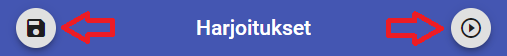

# Treenikello training clock app

This app is designed to help people keep track of their excercise plan by rendering a clock face which displays the planned exercise as sectors drawn to the clock face. The app also enables its users to write a more detailed description for each of their excercise segments.
## Table of Contents

- [Treenikello training clock app](#treenikello-training-clock-app)
  - [Table of Contents](#table-of-contents)
  - [Usage](#usage)
    - [Main controls](#main-controls)
    - [Monitor tab](#monitor-tab)
    - [Sections tab](#sections-tab)
    - [Exercises tab](#exercises-tab)
  - [Future plans](#future-plans)

## Usage

The app is designed to be simple so that the user can focus on what's important -training. After setting up your exercises editing and using them takes only a couple of swipes and clicks!

### Main controls

The buttons on the menu bar are for saving current settings and quick starting the selected exercise.

Underneath is a set of tabs that can be used to view exercise details and customize the content. 
- Tab 1 is the monitor tab where the user can see the current active workout segment with its description.
- Tab 2 is the sections tab where the user can manage currently selected workouts sections.
- Tab 3 is the exercises tab where the user can manage exercises.

### Monitor tab

Monitor your exercise status in this tab. Currently active section with its' description is highlighted. You can also see the completed- and upcoming sections and an

### Sections tab

Add, modify and remove sections in this tab.

### Exercises tab

Pick a preset excercise or add a new one on the exercise tab. The user can also remove exercises in this tab.

## Future plans

- Complete refactorings and cleanups and bump version to 1.0.0, update documentation, move modification work to branches
- Include an optional set up time for sections to help estimate the real duration of excercises
- Create a web service where users can get new presets and submit their exercises
- Possibility to select multiple exercises, migrating to a more modular approach where users can compose their actual exercise from smaller parts.